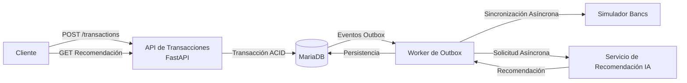

# Aplicación SmartBancs

SmartBancs es una plataforma de transacciones financieras de prueba de concepto creada
para un desafío técnico.

El proyecto demuestra el procesamiento seguro de transacciones financieras,
control de concurrencia, idempotencia, integración asíncrona con un sistema bancario
heredado (*legacy*), recomendaciones de IA asíncronas, procesamiento ETL,
observabilidad, pruebas automatizadas y despliegue en contenedores.

> Este repositorio es un MVP creado con fines de evaluación y no debe
> considerarse una plataforma bancaria de producción.

---

## Arquitectura



La ruta crítica de la transacción se limita intencionalmente a:

```text
Cliente -> API de Transacciones -> MariaDB -> Cliente
```

El procesamiento de Bancs y de la IA es asíncrono y, por lo tanto, no bloquea la
respuesta de la transferencia financiera.

---

## Stack Tecnológico

| Tecnología | Propósito |
|---|---|
| Python 3.11 | Lenguaje de la aplicación |
| FastAPI | APIs REST |
| SQLAlchemy | Acceso a base de datos y gestión de transacciones |
| MariaDB 11 / InnoDB | Base de datos transaccional |
| PyMySQL | Controlador de MariaDB |
| HTTPX | Comunicación HTTP entre servicios |
| Pandas | Procesamiento ETL |
| Prometheus Client | Métricas de la aplicación |
| Pytest | Pruebas automatizadas |
| Docker | Contenerización |
| Docker Compose | Orquestación de infraestructura local |

---

## Características Principales

SmartBancs incluye:

- transferencias financieras entre cuentas;
- transacciones de base de datos ACID;
- bloqueo a nivel de fila con `SELECT ... FOR UPDATE`;
- protección contra fondos insuficientes;
- soporte para `Idempotency-Key`;
- patrón *Transactional Outbox*;
- sincronización asíncrona con el sistema bancario heredado (Bancs);
- generación asíncrona de recomendaciones de IA; - Procesamiento ETL de datos de transacciones sin procesar;
- identificadores de correlación;
- registros de la aplicación;
- métricas compatibles con Prometheus;
- pruebas automatizadas de concurrencia;
- despliegue con Docker Compose.

---

## Procesamiento de transacciones

Una transferencia sigue esta secuencia:

```text
Solicitud
| 
v
Validar Idempotency-Key
| 
v
Bloquear cuentas
SELECT ... FOR UPDATE
| 
v
Validar moneda
| 
v
Validar saldo
| 
v
Actualizar saldos
| 
v
Crear transacción
| 
v
Crear evento Outbox
| 
v
COMMIT
| 
v
Devolver respuesta
```

El registro de la transacción, las modificaciones del saldo de la cuenta
y el evento Outbox se confirman (commit) de forma atómica.

---

## Idempotencia

Cada solicitud de transacción requiere:

```http
Idempotency-Key: valor-único
```

Si se envía nuevamente la misma solicitud con la misma clave, SmartBancs
devuelve la transacción creada anteriormente en lugar de realizar la
transferencia dos veces.

Si se reutiliza la misma clave con datos de transacción diferentes, la API
devuelve:

```text
409 Conflict
```

---

## Concurrencia

SmartBancs utiliza bloqueo de filas de MariaDB/InnoDB:

```sql
SELECT ...
FROM accounts
ORDER BY id
FOR UPDATE;
```

Esto evita que transferencias concurrentes utilicen el mismo saldo de
cuenta varias veces.

La prueba automatizada de concurrencia ejecuta 10 transferencias simultáneas
de 20 USD contra una cuenta que contiene 100 USD.

Resultado esperado:

```text
5 transferencias exitosas
5 transferencias rechazadas
Saldo de origen: 0 USD
Saldo de destino: 100 USD
```

---

## Integración asíncrona con Bancs

La API de transacciones no se comunica directamente con Bancs.

En su lugar:

```text
Transacción
| 
v
Evento Outbox
| 
v
Worker
| 
v
Mock de Bancs
```

Este diseño evita que la latencia o la falta de disponibilidad temporal de Bancs
bloqueen el endpoint de transacciones orientado al cliente.

---

## Servicio de recomendación por IA

El proyecto incluye un servicio independiente de recomendación por IA. El servicio actual es una simulación funcional determinista identificada como:

```text
mock-v1
```

Demuestra cómo el procesamiento mediante IA puede separarse de la ruta crítica
de las transacciones financieras.

La implementación actual no se presenta como un modelo de aprendizaje automático entrenado.

Las consideraciones sobre el ciclo de vida de la IA en producción se describen en:

[Ciclo de vida de la IA](docs/ai-lifecycle.md)

---

## ETL

El módulo ETL procesa datos de transacciones sin procesar utilizando Pandas.

Realiza las siguientes operaciones:

- eliminación de duplicados;
- normalización de espacios en blanco;
- normalización de divisas;
- validación numérica;
- filtrado de importes no válidos;
- filtrado de valores faltantes;
- normalización de fechas.

Ejecútelo con:

```bash
python -m etl.transform
```

---

## Requisitos

El entorno recomendado es:

```text
Docker Desktop
Docker Compose
Git
```

Python 3.11 solo es necesario si se ejecuta la aplicación o las pruebas
fuera de Docker.

---

## Configuración del entorno

Cree el archivo de entorno a partir del ejemplo:

### Windows PowerShell

```powershell
Copy-Item .env.example .env
```

### Linux / macOS

```bash
cp .env.example .env
```